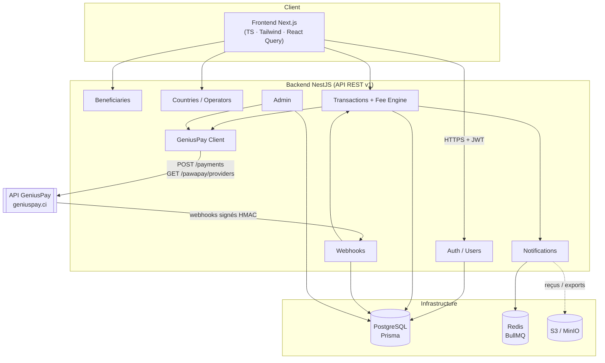
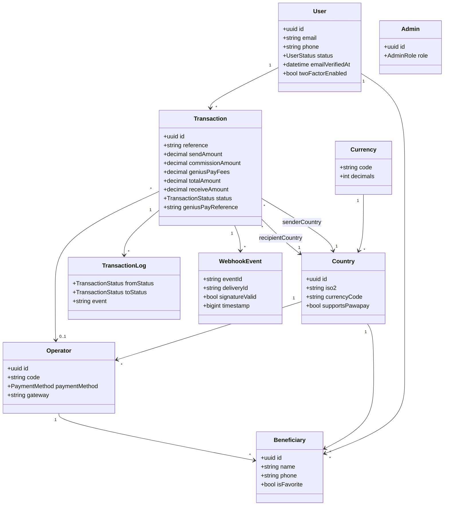
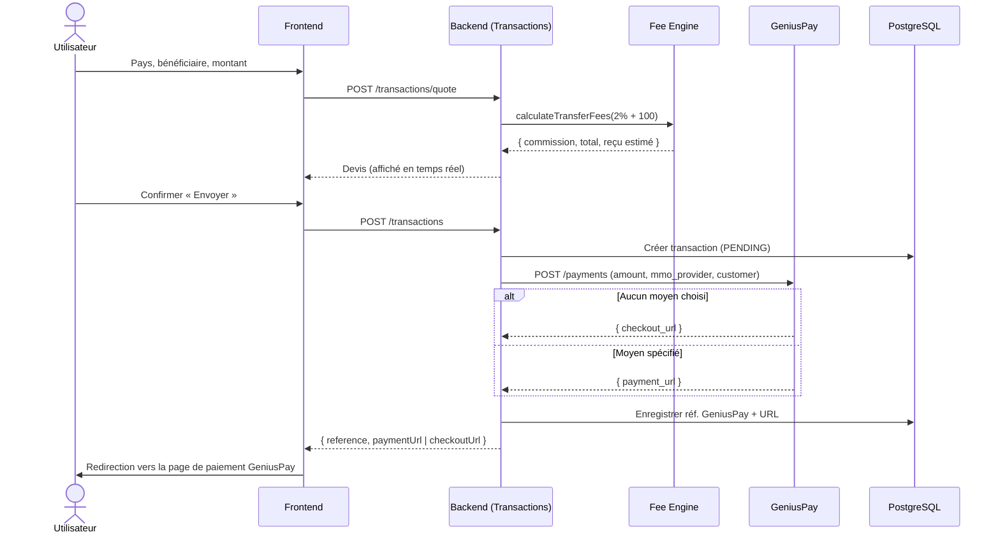
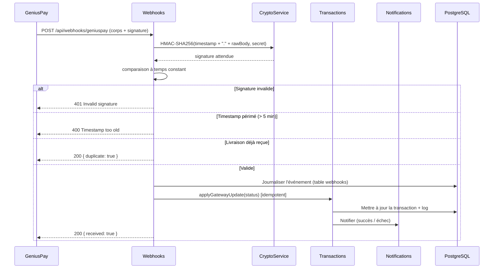
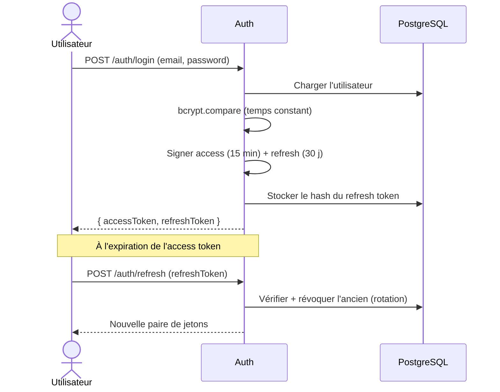

# Architecture — AfriTransfer

Ce document décrit l'architecture de la plateforme, les diagrammes UML, les
diagrammes de séquence des flux principaux et les choix techniques.

## 1. Vue d'ensemble

AfriTransfer est une plateforme de transfert d'argent panafricaine construite sur
une architecture **modulaire** (NestJS) respectant les principes **SOLID**. Le
paiement est délégué à l'API **GeniusPay**.

## 2. Modules backend

| Module | Responsabilité |
|--------|----------------|
| `auth` | Inscription, connexion, JWT (access/refresh + rotation), vérif. email/tél., reset mot de passe, 2FA (architecture). |
| `users` | Profil utilisateur. |
| `beneficiaries` | Carnet de bénéficiaires favoris (scopé par utilisateur). |
| `countries` | Pays, devises, opérateurs ; détection pays/opérateur ; synchro GeniusPay. |
| `geniuspay` | Client HTTP typé de l'API GeniusPay (paiements, providers, solde). |
| `transactions` | Moteur de frais `calculateTransferFees()`, flux d'envoi, cycle de vie, reçus. |
| `webhooks` | Réception sécurisée des webhooks GeniusPay (HMAC, anti-rejeu, idempotence). |
| `notifications` | File BullMQ + canaux email / SMS / push. |
| `admin` | Dashboard : utilisateurs, transactions, pays, commissions, stats, export, solde, webhooks. |
| `health` | Supervision (liveness/readiness + ping DB). |

Couche transverse (`common/`) : `CryptoService` (AES-256-GCM, HMAC), filtres
d'exceptions, intercepteurs (enveloppe de réponse, logs), garde JWT global,
garde de rôles, `AuditService`, pagination.

## 3. Modèle de domaine (UML)

## 4. Diagramme de séquence — Envoi d'argent

## 5. Diagramme de séquence — Webhook & confirmation

## 6. Authentification

## 7. Choix techniques

- **Séparation collecte / décaissement** : la commission AfriTransfer est ajoutée
  au montant collecté ; les frais réels GeniusPay proviennent de la réponse/des
  webhooks. La conversion de devise (XOF↔XAF = 1:1) est estimée à l'affichage et
  confirmée par GeniusPay.
- **Idempotence des webhooks** : déduplication par `X-Webhook-Delivery` + statuts
  terminaux non réécrits, garantissant l'exactitude malgré les renvois.
- **Sécurité des secrets** : clés/secret chiffrés AES-256-GCM avant stockage ;
  jetons stockés en SHA-256 (jamais en clair).
- **Scalabilité** : traitements asynchrones (BullMQ/Redis), index PostgreSQL sur
  les colonnes de filtrage, pagination systématique, statelessness de l'API (JWT).

Voir aussi : [`database-schema.md`](database-schema.md),
[`geniuspay-integration.md`](geniuspay-integration.md),
[`security.md`](security.md), [`deployment.md`](deployment.md).
