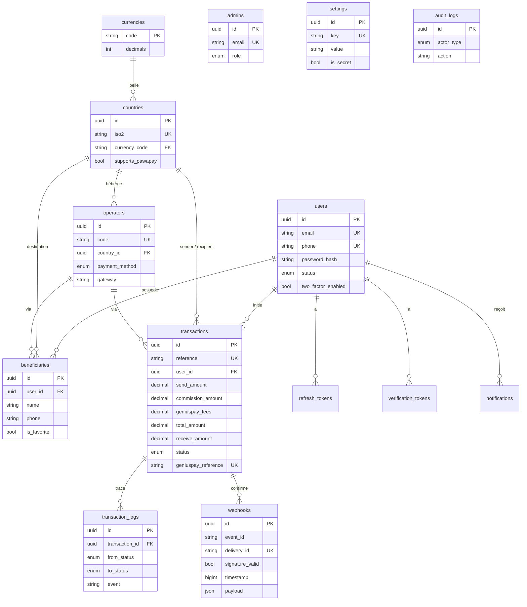

# Schéma de base de données — AfriTransfer

Base : **PostgreSQL** · ORM : **Prisma**. Schéma source :
[`backend/prisma/schema.prisma`](../backend/prisma/schema.prisma).

## Diagramme entité-association



## Tables

| Table | Rôle |
|-------|------|
| **users** | Comptes clients. Mot de passe en BCrypt, secret 2FA chiffré AES. Statut PENDING→ACTIVE après vérification email. |
| **verification_tokens** | Jetons email/téléphone/reset (hash SHA-256 + expiration + consommation unique). |
| **refresh_tokens** | Sessions de rafraîchissement JWT (hash, rotation, révocation). |
| **currencies** | Référentiel ISO 4217 (XOF, XAF, CDF, USD…) + nombre de décimales. |
| **countries** | Pays supportés (ISO2/ISO3, indicatif, devise, région, `supports_pawapay`). |
| **operators** | Opérateurs Mobile Money (code GeniusPay, moyen de paiement, gateway). |
| **beneficiaries** | Bénéficiaires favoris d'un utilisateur. |
| **transactions** | Transferts : décomposition financière complète, statut, références GeniusPay, URLs de paiement. |
| **transaction_logs** | Historique des transitions d'état (audit du cycle de vie). |
| **webhooks** | Journal des événements GeniusPay reçus (anti-rejeu + idempotence). |
| **admins** | Comptes administrateurs (rôles SUPER_ADMIN / ADMIN / SUPPORT / COMPLIANCE). |
| **settings** | Configuration clé/valeur (commission, environnement…). Valeurs secrètes chiffrées. |
| **audit_logs** | Journal d'audit transverse (qui, quoi, quand, d'où). |
| **notifications** | Notifications émises (canal, statut, destinataire). |

## Décomposition financière d'une transaction

| Colonne | Description |
|---------|-------------|
| `send_amount` | Montant destiné au bénéficiaire (devise d'envoi). |
| `commission_amount` | Commission AfriTransfer = 2 % × montant + 100 FCFA. |
| `geniuspay_fees` | Frais du fournisseur de paiement (réels via réponse/webhook GeniusPay). |
| `total_amount` | Montant débité = `send_amount` + `commission_amount` + `geniuspay_fees`. |
| `receive_amount` | Montant estimé reçu, converti en devise d'arrivée. |

## Migrations & amorçage

```bash
npx prisma migrate deploy   # applique prisma/migrations/0_init
npm run seed                # devises, pays, opérateurs, paramètres, admin
```

Le seed charge 10 devises, 17 pays et 36 opérateurs issus du catalogue GeniusPay
(MVP Afrique de l'Ouest + Centrale + extension PawaPay). En production, les
opérateurs sont rafraîchis dynamiquement via `GET /pawapay/providers`.
